  

  

  

  𓆉 a soft milky-pink corner of the internet · pixels &amp; postgres 𓆉

  

<h3 align="center">⠀ ੈ♡ about</h3>

  

  

<h3 align="center">⠀ ੈ♡ stack</h3>

  
  
  

  
  
  
  
  
  

  
  
  
  

  
  

  
  
  
  
  
  
  

  
  
  
  
  
  
  
  

  

<h3 align="center">⠀ ੈ♡ stats</h3>

  
  

  

  

<h3 align="center">⠀ ੈ♡ reach me</h3>

  

 

  

  ♡ thanks for hopping by ♡

